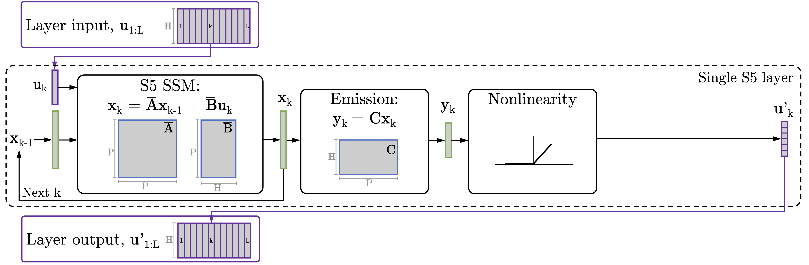

Simplified version of S5 jax/flax implementation from Smith, Warrington, Linderman 2023.

**Simplified State Space Layers for Sequence Modeling**  
Jimmy T.H. Smith\*, Andrew Warrington\*, Scott Linderman  
International Conference on Learning Representations, 2023.  
Notable-top-5% (Oral).  
[arXiv](https://arxiv.org/abs/2208.04933)  
[OpenReview](https://openreview.net/forum?id=Ai8Hw3AXqks)


<p style="text-align: center;">
Figure 1:  S5 uses a single multi-input, multi-output linear state-space model, coupled with non-linearities, to define a non-linear sequence-to-sequence transformation. Parallel scans are used for efficient offline processing. 
</p>


The S5 layer builds on the prior S4 work ([paper](https://arxiv.org/abs/2111.00396)). While it has departed considerably, this repository originally started off with much of the JAX implementation of S4 from the
Annotated S4 blog by Rush and Karamcheti (available [here](https://github.com/srush/annotated-s4)).


## Requirements & Installation
To install and run the code on a cluster with a module system (in the virtual environment "s5-gpu"):

```
$ module load anaconda3/2023.3
$ module load cudnn/cuda-11.x/8.2.0
$ conda create -n s5-gpu
$ conda activate s5-gpu
$ conda install pip
$ conda install jupyter

$ pip install -r requirements_gpu.txt
```

Then you have to fix the jax/cuda/cudnn versioning a little bit:

```
$ pip install jax "jaxlib==0.4.7+cuda11.cudnn82" -f https://storage.googleapis.com/jax-releases/jax_cuda_releases.html
$ pip install jax==0.4.10
```

(there might be a way to simplify this installation process).

## Repository Structure
Directories and files that ship with GitHub repo:
```
s5/                    Source code for models, datasets, etc.
    dataloading.py          Dataloading functions.
    layers.py               Defines the S5 layer which wraps the S5 SSM with nonlinearity, norms, dropout, etc.
    seq_model.py            Defines deep sequence models that consist of stacks of S5 layers.
    ssm.py                  S5 SSM implementation.
    ssm_init.py             Helper functions for initializing the S5 SSM .
    train.py                Training loop code.
    train_helpers.py        Functions for optimization, training and evaluation steps.
    dataloaders/            Code mainly derived from S4 processing each dataset.
    utils/                  Range of utility functions.
bin/                    Shell scripts for downloading data and running example experiments.
requirements_gpu.txt    Requirements for running in GPU mode (installation can be highly system-dependent).
run_train.py            Training loop entrypoint.
```

## Citation
Please use the following when citing our work:
```
@inproceedings{
smith2023simplified,
title={Simplified State Space Layers for Sequence Modeling},
author={Jimmy T.H. Smith and Andrew Warrington and Scott Linderman},
booktitle={The Eleventh International Conference on Learning Representations },
year={2023},
url={https://openreview.net/forum?id=Ai8Hw3AXqks}
}
```

Please reach out if you have any questions.

-- The S5 authors.
